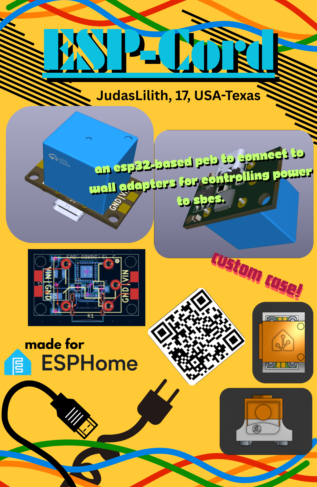
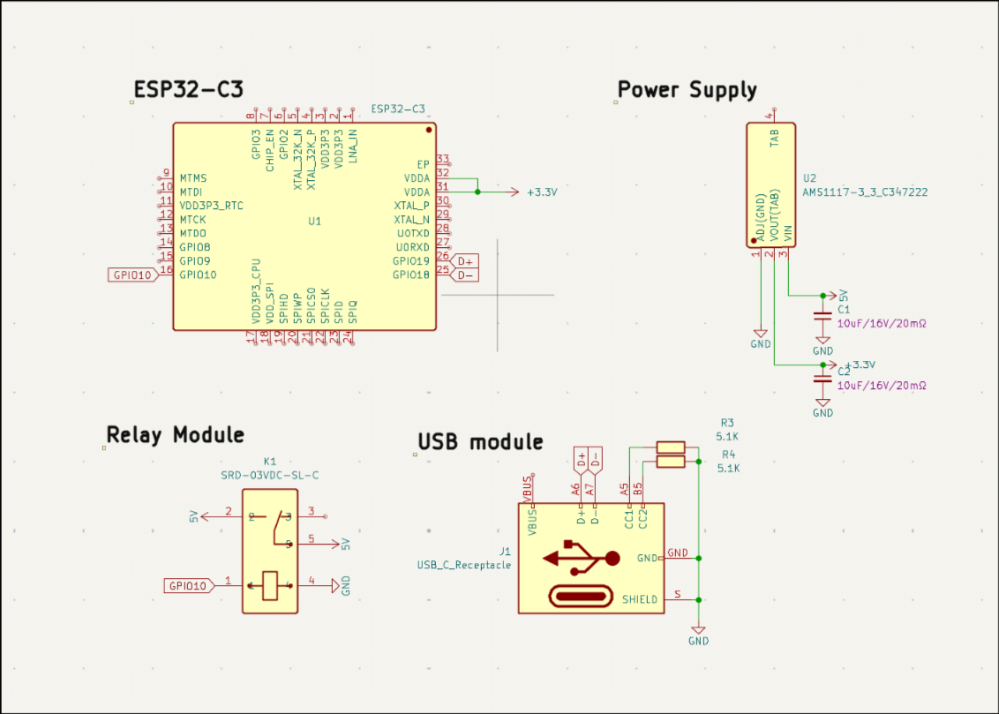
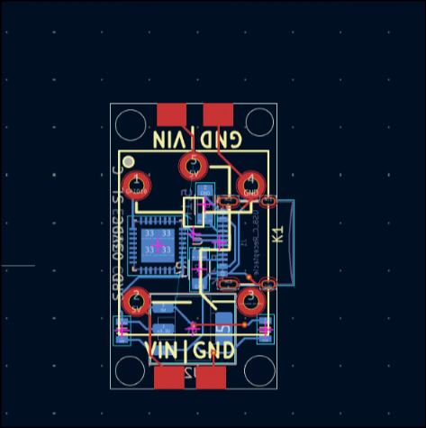
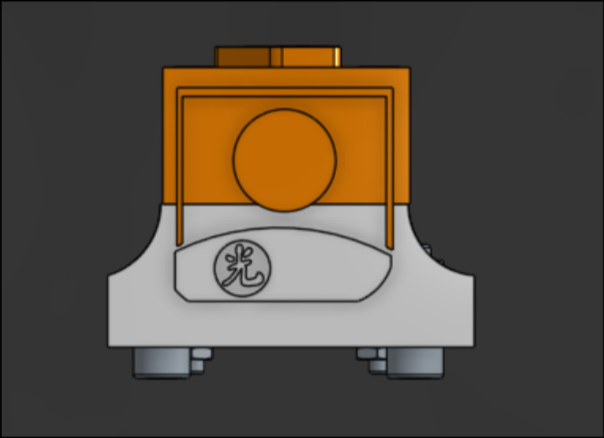
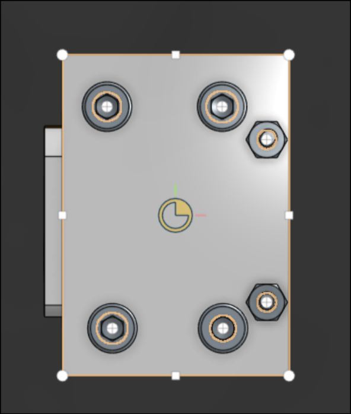
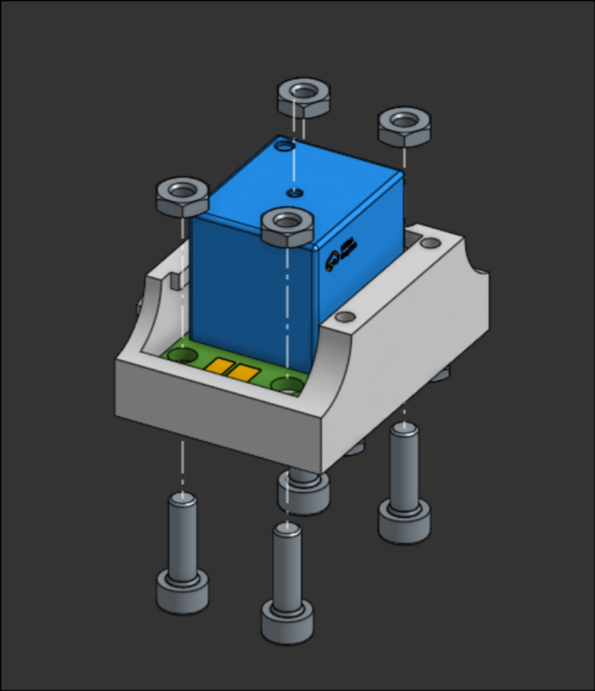
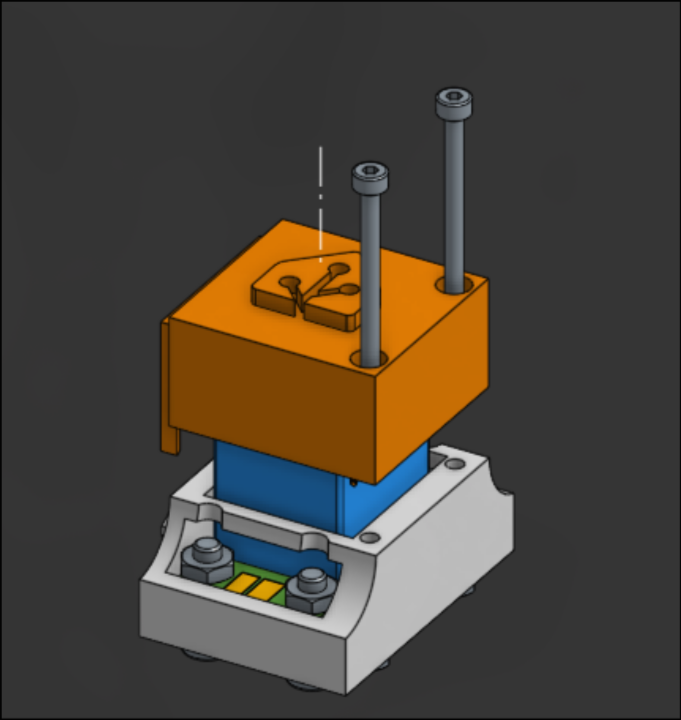
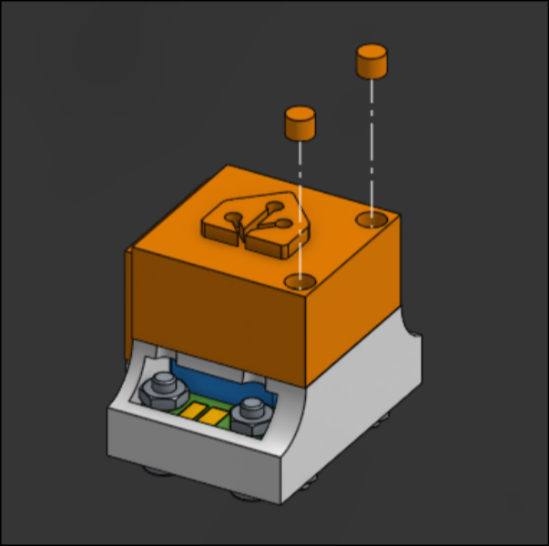
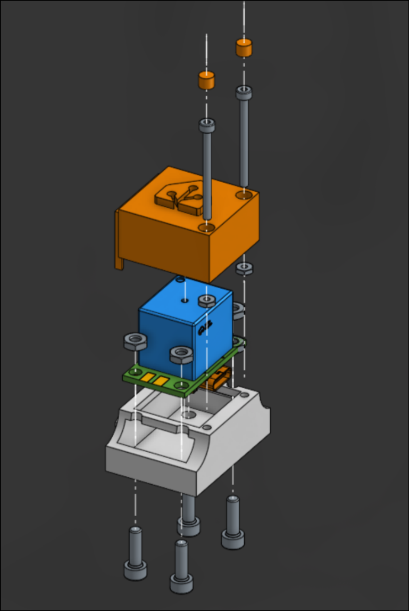
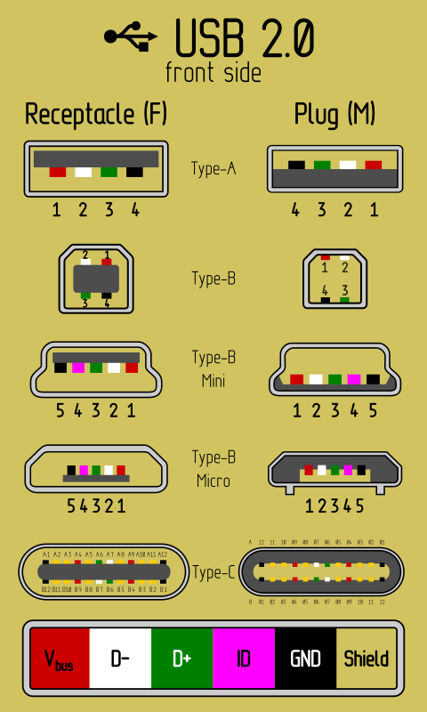

## ESPCord

* An ESP32-based  PCB to connect to Wall adapters for controlling power to SBCs.

### Why make this?

* I normally use a small Raspberry Pi Zero in order for me to control my Octoprint setup, but due to the board being connected constantly it cannot shut down with the normal octoprint UI. This is when I thought that I should have a method of controlling the power going to the Setup, so that it can properly reboot every time I manipulate its power source by being connected to Home Assistant.

* ### Don't you have wall plugs that do this?

  * You're absolutely right! however:
    * The prices are at least 30 dollars a pop
    * most of the cheaper ones want you to use their own crummy software
    * It's closed source(yuck!)
    * most of them connect to wall sockets, so if you move between countries where one uses 110 and the other uses 220, it's better to just connect from the wall adapter itself(since you know that the voltage coming from there is a regulated 5v.)

### Images

### How to Make one:

**WARNING!** The USB and the actual power supply coming from the wires are synonymous, so I do not recommend connecting the Power pins and the USB to flash the program at the same time.

* The step files for the cover are in hardware/STEP. For each of the PCB's models, it's inside /hardware/ESPCord/JLCImport.3dshapes/.

* Go to OnShape for the source files: [Link to Document](https://cad.onshape.com/documents/d3868ff451e5f7abe82f5476/w/f427325b5d68ac91fa5e3531/e/b186e742c5d57084cca7bd3f?renderMode=0&rightPanel=explodedViewPanel&uiState=6a36acb3a9f4b17da6166d23)

#### BOM:

For the Detailed version with comments, look at the BOM.csv

|           |     |                      |        |                                      |
| --------- | --- | -------------------- | ------ | ------------------------------------ |
| Reference | Qty | Value                | Price  | Footprint                            |
| C1,C2     | 2   | 10uF_0805_16V_lowESR | 0.091  | PCM_4ms_Capacitor:C_0805             |
| J1        | 1   | USB_C_Receptacle     | 0.05   | PCM_SparkFun-Connector:USB-C_16      |
| K1        | 1   | SRD-03VDC-SL-C       | 0.41   | JLCImport:SRD-03VDC-SL-C             |
| R3,R4     | 2   | 5.1K                 | 0.02   | PCM_fab:R_1206                       |
| U1        | 1   | ESP32-C3             | 1.83   | PCM_fab:QFN-32_EP_5x5_Pitch0.5mm     |
| U2        | 1   | AMS1117-3_3_C347222  | 0.01   | PCM_Package_TO_SOT_SMD_AKL:SOT-223-5 |
|           |     |                      | 0      |                                      |
|           | 4   | M3 Bolts 10mm        | 19.99  | N/A                                  |
|           | 2   | M2 Bolts 25mm        | 0      | N/A                                  |
|           | 4   | M3 Nuts              | 0      | N/A                                  |
|           | 2   | m2 Nuts              | 0      | N/A                                  |
|           |     |                      |        |                                      |
|           |     | Total:               | 22.351 |                                      |
					
		Total:	22.351		

* The case has around 12 grams of PLA, so it's most likely negligible.

### For the design checker: I already have a kit with M2-M3 bolts and nuts, so the amazon kit will be redundant in my case. I just wantd to show where other people could source the parts in bulk.

#### Assembly:

#### Whole Model:

### Next Steps:

* Time to actually connect the relay with the power cables now.

* Now all you need to do is:

  * Split the cable in half
  * Find the Red and Black wires, then solder them onto each pads with the Label GND and VIN.
  * Be sure that the nuts do not touch, if using bare metal nuts and bolts.

* Great job following along! now you must flash the ESP with ESPHome.
(You can find more information at: https://esphome.io/guides/getting_started_hassio/)

* I tried to make a simple configuration file in /firmware, but it's not tested yet so take it with a grain of salt please :3

